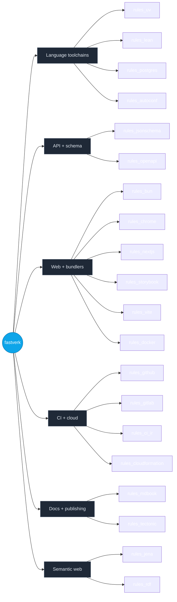

<!--
  Hand-authored shell + auto-generated module table.

  This file is partly generated by botnoc-readme. The regions
  bounded by BOTNOC:MODULES_TABLE HTML-comment markers (search
  for that string below) are rewritten in-place by that tool
  from the live state of fastverk/bazel-registry plus GitHub
  repo descriptions. Everything outside those markers is
  hand-authored — feel free to edit.

  Regenerate locally:
    cd ../botnoc
    cargo run -p botnoc-readme -- \
      --registry ../bazel-registry \
      --readme ../dotgithub/profile/README.md

  Or via the planned render-profile workflow in this repo's
  .github/workflows/ (see ROADMAP item in fastverk/botnoc).

  NOTE: do not write the literal opener/closer markers inside
  this comment block. HTML comments cannot nest, and the splicer
  uses first-occurrence matching — putting them here would both
  show up as raw text on GitHub and confuse botnoc-readme.
-->

# fastverk

A constellation of Bazel `rules_*` modules sharing a single bzlmod
registry. Each module is one concern; compose them to get a
hermetic, reproducible build for whatever stack you're shipping.

## What's in the registry



## Modules

<!-- BOTNOC:MODULES_TABLE -->
| Module | Latest | Description |
|---|---|---|
| [`rules_agentic_ide`](https://github.com/fastverk/rules_agentic_ide) | 0.0.3 | `fastverk/rules_agentic_ide` |
| [`rules_autoconf`](https://github.com/fastverk/rules_autoconf) | 0.1.0 | `fastverk/rules_autoconf` |
| [`rules_beam`](https://github.com/fastverk/rules_beam) | 0.0.2 | `fastverk/rules_beam` |
| [`rules_bibtex`](https://github.com/fastverk/rules_bibtex) | 0.0.6 | `fastverk/rules_bibtex` |
| [`rules_bun`](https://github.com/fastverk/rules_bun) | 0.2.0 | `fastverk/rules_bun` |
| [`rules_cc_cross`](https://github.com/fastverk/rules_cc_cross) | 0.1.0 | `fastverk/rules_cc_cross` |
| [`rules_chrome`](https://github.com/fastverk/rules_chrome) | 0.1.0 | `fastverk/rules_chrome` |
| [`rules_ci_ir`](https://github.com/fastverk/rules_ci_ir) | 0.0.1 | `fastverk/rules_ci_ir` |
| [`rules_cloudformation`](https://github.com/fastverk/rules_cloudformation) | 0.7.0 | `fastverk/rules_cloudformation` |
| [`rules_docker`](https://github.com/fastverk/rules_docker_compose) | 0.2.6 | `fastverk/rules_docker_compose` |
| [`rules_github`](https://github.com/fastverk/rules_github) | 0.1.2 | `fastverk/rules_github` |
| [`rules_gitlab`](https://github.com/fastverk/rules_gitlab) | 0.1.3 | `fastverk/rules_gitlab` |
| [`rules_huggingface`](https://github.com/fastverk/rules_huggingface) | 0.0.3 | `fastverk/rules_huggingface` |
| [`rules_jena`](https://github.com/fastverk/rules_jena) | 0.3.2 | `fastverk/rules_jena` |
| [`rules_jsonschema`](https://github.com/fastverk/rules_jsonschema) | 0.3.0 | `fastverk/rules_jsonschema` |
| [`rules_lang`](https://github.com/fastverk/polyglot) | 0.0.13 | `fastverk/polyglot` |
| [`rules_lean`](https://github.com/fastverk/rules_lean) | 0.3.9 | `fastverk/rules_lean` |
| [`rules_lora`](https://github.com/fastverk/rules_lora) | 0.0.35 | `fastverk/rules_lora` |
| [`rules_mdbook`](https://github.com/fastverk/rules_mdbook) | 0.3.1 | `fastverk/rules_mdbook` |
| [`rules_meridian`](https://github.com/mattmarshall/meridian) | 0.2.1 | `mattmarshall/meridian` |
| [`rules_meson`](https://github.com/fastverk/rules_meson) | 0.0.0 | `fastverk/rules_meson` |
| [`rules_nextjs`](https://github.com/fastverk/rules_nextjs) | 0.2.0 | `fastverk/rules_nextjs` |
| [`rules_openapi`](https://github.com/fastverk/rules_openapi) | 0.2.1 | `fastverk/rules_openapi` |
| [`rules_polyglot`](https://github.com/fastverk/polyglot) | 0.0.10 | `fastverk/polyglot` |
| [`rules_postgres`](https://github.com/fastverk/rules_postgres) | 0.4.1 | `fastverk/rules_postgres` |
| [`rules_puml`](https://github.com/fastverk/rules_puml) | 0.0.2 | `fastverk/rules_puml` |
| [`rules_rdf`](https://github.com/fastverk/rules_rdf) | 0.3.0 | `fastverk/rules_rdf` |
| [`rules_runpod`](https://github.com/fastverk/rules_runpod) | 0.0.10 | `fastverk/rules_runpod` |
| [`rules_schema_org`](https://github.com/fastverk/rules_schema_org) | 0.0.1 | `fastverk/rules_schema_org` |
| [`rules_spec`](https://github.com/fastverk/rules_spec) | 0.5.1 | `fastverk/rules_spec` |
| [`rules_ssh_tui`](https://github.com/fastverk/rules_ssh_tui) | 0.0.5 | `fastverk/rules_ssh_tui` |
| [`rules_storybook`](https://github.com/fastverk/rules_storybook) | 0.1.0 | `fastverk/rules_storybook` |
| [`rules_tectonic`](https://github.com/fastverk/rules_tectonic) | 0.2.0 | `fastverk/rules_tectonic` |
| [`rules_uv`](https://github.com/fastverk/rules_uv) | 0.7.4 | `fastverk/rules_uv` |
| [`rules_vite`](https://github.com/fastverk/rules_vite) | 0.1.0 | `fastverk/rules_vite` |
| [`rules_walkthrough`](https://github.com/fastverk/rules_walkthrough) | 0.1.0 | `fastverk/rules_walkthrough` |
| [`rules_web`](https://github.com/fastverk/rules_web) | 0.0.1 | `fastverk/rules_web` |
<!-- /BOTNOC:MODULES_TABLE -->

## Quick start

`.bazelrc`:

```
common --registry=https://raw.githubusercontent.com/fastverk/bazel-registry/main/
common --registry=https://bcr.bazel.build/
```

`MODULE.bazel`:

```python
bazel_dep(name = "rules_uv", version = "0.7.3")
# … etc.
```

See each module's README for module-specific setup.

## Registry split

fastverk and citizen-sh now publish from separate registries.

- fastverk modules: `https://raw.githubusercontent.com/fastverk/bazel-registry/main/`
- citizen-sh modules: `https://raw.githubusercontent.com/citizen-sh/bazel-registry/main/`

Use the registry chain that matches the modules you consume.

## Tooling

- **[bazel-registry](https://github.com/fastverk/bazel-registry)** —
  the bzlmod registry itself + `rels`, the cross-repo release +
  audit CLI.
- **botnoc** — bot-driven Network Operations Center: gRPC services
  + Lean specs + a meridian-rendered TUI for orchestrating work
  across the constellation. The tool that renders the table above
  ships with it.

## Philosophy

- **Bazel-native first.** Cross-module workflows are expressible
  as Bazel targets, not out-of-band scripts.
- **Hermetic by default.** Each module either pins its upstream
  artifact's sha256 + extracts deterministically, or vendors a
  source tarball with the same. Host-tool dependencies are
  limited to OS-provided utilities that don't drift.
- **Honest about gaps.** Modules ship at `0.0.x` with explicit
  "no smoke" labels when not yet verified end-to-end. We don't
  pretend.
- **One thing per module.** Splitting beats coupling.

## Contributing

Each module has its own issues + PRs. For org-wide coordination
(cross-module bumps, registry-tier moves, agent dispatch),
botnoc is the entry point.
