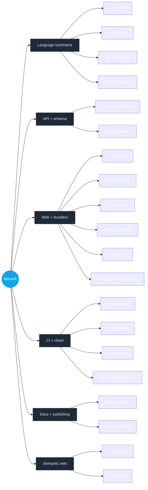

<!--
  Hand-authored shell + auto-generated module table.

  This file is partly generated by botnoc-readme. The regions
  bounded by BOTNOC:MODULES_TABLE HTML-comment markers (search
  for that string below) are rewritten in-place by that tool
  from the live state of fastverk/bazel-registry plus GitHub
  repo descriptions. Everything outside those markers is
  hand-authored — feel free to edit.

  Regenerate locally:
    cd ../botnoc
    cargo run -p botnoc-readme -- \
      --registry ../bazel-registry \
      --readme ../dotgithub/profile/README.md

  Or via the planned render-profile workflow in this repo's
  .github/workflows/ (see ROADMAP item in fastverk/botnoc).

  NOTE: do not write the literal opener/closer markers inside
  this comment block. HTML comments cannot nest, and the splicer
  uses first-occurrence matching — putting them here would both
  show up as raw text on GitHub and confuse botnoc-readme.
-->

# fastverk

A constellation of Bazel `rules_*` modules sharing a single bzlmod
registry. Each module is one concern; compose them to get a
hermetic, reproducible build for whatever stack you're shipping.

## What's in the registry



## Modules

<!-- BOTNOC:MODULES_TABLE -->
| Module | Latest | Description |
|---|---|---|
| [`rules_autoconf`](https://github.com/fastverk/rules_autoconf) | 0.1.0 | Bazel-native autoconf-style configuration. cc_check_{header,function,symbol} + config_header — replaces autoconf+m4 with a graph of cache-aware Bazel actions. |
| [`rules_bun`](https://github.com/fastverk/rules_bun) | 0.2.0 | Bazel rules for Bun. Hermetic 'bun test' + sandbox-escaping 'bun run' against prebuilt binaries from oven-sh/bun releases. |
| [`rules_chrome`](https://github.com/fastverk/rules_chrome) | 0.1.0 | Bazel rules for Chrome for Testing. Hermetic, sha256-pinned chrome + chromedriver per platform; launchers + opt-in Playwright (py + js) macros with Bazel-managed user-data-dirs. |
| [`rules_ci_ir`](https://github.com/fastverk/rules_ci_ir) | 0.0.1 | Bazel rules + Rust translator + Lean 4 IR for provably correct translations between GitLab CI, GitHub Actions, and Bazel rules. |
| [`rules_cloudformation`](https://github.com/fastverk/rules_cloudformation) | 0.6.0 | Bazel rules for AWS CloudFormation templates — schema-derived typed Bazel rules via rules_jsonschema, Java-based linter via rules_java + the official cloudformation-template-schema. |
| [`rules_docker_compose`](https://github.com/fastverk/rules_docker_compose) | 0.2.6 | — |
| [`rules_github`](https://github.com/fastverk/rules_github) | 0.1.1 | Bazel repository rules for GitHub-release-based content. Common substrate for rules_mdbook, rules_bun, rules_postgres, et al. |
| [`rules_gitlab`](https://github.com/fastverk/rules_gitlab) | 0.1.3 | Bazel rules for GitLab CI: schema-pinned validate + glab-backed server-side lint. |
| [`rules_jena`](https://github.com/fastverk/rules_jena) | 0.2.1 | Apache Jena toolchain implementations for rules_rdf — SPARQL engine (ARQ), SHACL validator, Turtle/N-Triples serializers, OWL reasoner. Java tools built via rules_java + Maven. |
| [`rules_jsonschema`](https://github.com/fastverk/rules_jsonschema) | 0.3.0 | Bazel rules turning JSON Schema into typed code via a per-language plugin contract (Rust, Go, Starlark) |
| [`rules_lean`](https://github.com/fastverk/rules_lean) | 0.3.0 | Bazel rules for Lean 4 with Lake integration (rules_lean). Reuses Lake's mathlib cache via lake_workspace repository rule. |
| [`rules_mdbook`](https://github.com/fastverk/rules_mdbook) | 0.3.0 | Bazel rules for mdbook with mdbook-mermaid plugin support. Hermetic, sha256-pinned binaries; mdbook_book rule produces a packaged HTML tarball. |
| [`rules_nextjs`](https://github.com/fastverk/rules_nextjs) | 0.1.1 | Bazel rules for Next.js. Hermetic 'next build' with .next/ as a declared output directory. |
| [`rules_openapi`](https://github.com/fastverk/rules_openapi) | 0.2.0 | Bazel rules turning OpenAPI 3 specs into typed code (Rust client via progenitor for v0.1), layered on rules_jsonschema's plugin contract |
| [`rules_postgres`](https://github.com/fastverk/rules_postgres) | 0.2.0 | Bazel rules for PostgreSQL tooling: libpg_query + raw PG source. Hermetic, sha256-pinned. Includes pg_parse_valid_test for SQL-emit CI gates. |
| [`rules_rdf`](https://github.com/fastverk/rules_rdf) | 0.2.0 | Bazel rules for RDF — toolchain types for SPARQL, SHACL validation, format conversion, and reasoning. Concrete implementations live in sibling repos like rules_jena. |
| [`rules_storybook`](https://github.com/fastverk/rules_storybook) | 0.1.0 | Bazel rules for Storybook: hermetic build, deterministic story manifest, sandbox-escaping dev runner. |
| [`rules_tectonic`](https://github.com/fastverk/rules_tectonic) | 0.1.1 | Bazel rules to compile LaTeX into PDFs via tectonic. |
| [`rules_uv`](https://github.com/fastverk/rules_uv) | 0.7.3 | Bazel rules for uv (Astral's Python package manager) |
| [`rules_vite`](https://github.com/fastverk/rules_vite) | 0.1.0 | Bazel rules for Vitest under aspect_rules_js. Hermetic js_test wrapper for vitest. |
<!-- /BOTNOC:MODULES_TABLE -->

## Quick start

`.bazelrc`:

```
common --registry=https://raw.githubusercontent.com/fastverk/bazel-registry/main/
common --registry=https://bcr.bazel.build/
```

`MODULE.bazel`:

```python
bazel_dep(name = "rules_uv", version = "0.7.3")
# … etc.
```

See each module's README for module-specific setup.

## Premium tier

There's a sibling registry for **private** fastverk modules —
[`fastverk/bazel-registry-premium`](https://github.com/fastverk/bazel-registry-premium).
Modules there target premium / NDA'd / early-iteration use cases
(currently rules_lang, rules_lora, rules_meson; embedded-systems
family pending). The registry repo itself is public; its
`source.json` entries point at private GitHub tarballs that require
auth.

If you have access:

```
common --registry=https://raw.githubusercontent.com/fastverk/bazel-registry-premium/main/
common --registry=https://raw.githubusercontent.com/fastverk/bazel-registry/main/
common --registry=https://bcr.bazel.build/
```

Premium first so its entries win over BCR for the same module name.
See the [premium registry's README](https://github.com/fastverk/bazel-registry-premium#auth)
for the credential-helper or `~/.netrc` setup needed to fetch the
private tarballs.

## Tooling

- **[bazel-registry](https://github.com/fastverk/bazel-registry)** —
  the bzlmod registry itself + `rels`, the cross-repo release +
  audit CLI. The same `rels` CLI maintains the premium registry
  (just pass `--registry-root` pointing at the premium checkout).
- **[bazel-registry-premium](https://github.com/fastverk/bazel-registry-premium)** —
  private-module registry (described above).
- **botnoc** — bot-driven Network Operations Center: gRPC services
  + Lean specs + a meridian-rendered TUI for orchestrating work
  across the constellation. The tool that renders the table above
  ships with it.

## Philosophy

- **Bazel-native first.** Cross-module workflows are expressible
  as Bazel targets, not out-of-band scripts.
- **Hermetic by default.** Each module either pins its upstream
  artifact's sha256 + extracts deterministically, or vendors a
  source tarball with the same. Host-tool dependencies are
  limited to OS-provided utilities that don't drift.
- **Honest about gaps.** Modules ship at `0.0.x` with explicit
  "no smoke" labels when not yet verified end-to-end. We don't
  pretend.
- **One thing per module.** Splitting beats coupling.

## Contributing

Each module has its own issues + PRs. For org-wide coordination
(cross-module bumps, registry-tier moves, agent dispatch),
botnoc is the entry point.
