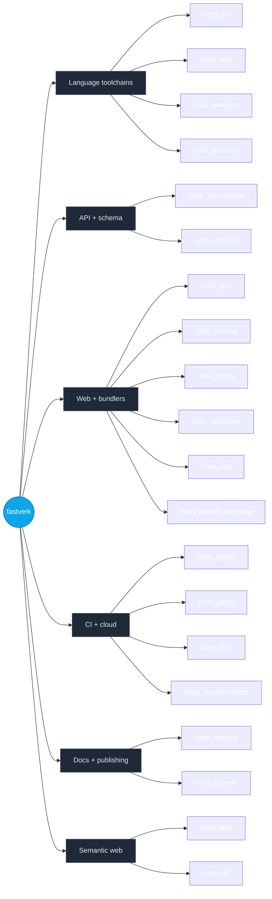

<!--
  Hand-authored shell + auto-generated module table.

  This file is partly generated by botnoc-readme. The regions
  bounded by BOTNOC:MODULES_TABLE HTML-comment markers (search
  for that string below) are rewritten in-place by that tool
  from the live state of fastverk/bazel-registry plus GitHub
  repo descriptions. Everything outside those markers is
  hand-authored — feel free to edit.

  Regenerate locally:
    cd ../botnoc
    cargo run -p botnoc-readme -- \
      --registry ../bazel-registry \
      --readme ../dotgithub/profile/README.md

  Or via the planned render-profile workflow in this repo's
  .github/workflows/ (see ROADMAP item in fastverk/botnoc).

  NOTE: do not write the literal opener/closer markers inside
  this comment block. HTML comments cannot nest, and the splicer
  uses first-occurrence matching — putting them here would both
  show up as raw text on GitHub and confuse botnoc-readme.
-->

# fastverk

A constellation of Bazel `rules_*` modules sharing a single bzlmod
registry. Each module is one concern; compose them to get a
hermetic, reproducible build for whatever stack you're shipping.

## What's in the registry



## Modules

<!-- BOTNOC:MODULES_TABLE -->
| Module | Latest | Description |
|---|---|---|
| [`decomposer`](https://github.com/fastverk/decomposer) | 0.0.1 | LLM-driven NL→atomic-claims decomposition toolkit; consumed by agora corpus pipeline |
| [`firefox_css_specs`](https://github.com/fastverk/rules_firefox) | 0.0.1 | Hermetic Firefox ESR source vendor — 7 modules carved from one tarball (rules_firefox + firefox_webidl/webidl_parser/html_parser/css_specs/spidermonkey/layout). |
| [`firefox_html_parser`](https://github.com/fastverk/rules_firefox) | 0.0.1 | Hermetic Firefox ESR source vendor — 7 modules carved from one tarball (rules_firefox + firefox_webidl/webidl_parser/html_parser/css_specs/spidermonkey/layout). |
| [`firefox_layout`](https://github.com/fastverk/rules_firefox) | 0.0.1 | Hermetic Firefox ESR source vendor — 7 modules carved from one tarball (rules_firefox + firefox_webidl/webidl_parser/html_parser/css_specs/spidermonkey/layout). |
| [`firefox_ply`](https://github.com/fastverk/rules_firefox) | 0.0.1 | Hermetic Firefox ESR source vendor — 7 modules carved from one tarball (rules_firefox + firefox_webidl/webidl_parser/html_parser/css_specs/spidermonkey/layout). |
| [`firefox_spidermonkey`](https://github.com/fastverk/rules_firefox) | 0.0.1 | Hermetic Firefox ESR source vendor — 7 modules carved from one tarball (rules_firefox + firefox_webidl/webidl_parser/html_parser/css_specs/spidermonkey/layout). |
| [`firefox_webidl`](https://github.com/fastverk/rules_firefox) | 0.0.1 | Hermetic Firefox ESR source vendor — 7 modules carved from one tarball (rules_firefox + firefox_webidl/webidl_parser/html_parser/css_specs/spidermonkey/layout). |
| [`firefox_webidl_parser`](https://github.com/fastverk/rules_firefox) | 0.0.1 | Hermetic Firefox ESR source vendor — 7 modules carved from one tarball (rules_firefox + firefox_webidl/webidl_parser/html_parser/css_specs/spidermonkey/layout). |
| [`meridian`](https://github.com/mattmarshall/meridian) | 0.2.0 | Lightweight web component runtime: typed worker controller, DOM patch helpers, template loader, UI kit CSS, and Bazel rules for declarative component graphs. |
| [`pinax`](https://github.com/mattmarshall/pinax) | 0.1.0 | Document-to-structure extraction. Apache Beam pipeline (PDF today; DOCX next) emitting typed DocumentPart records — paragraphs, headings, tables, embedded images. |
| [`polyglot_ast`](https://github.com/fastverk/polyglot) | 0.0.10 | Gauge-theoretic IR for multi-language code translation + corpus. Extracted from rules_lang. |
| [`rules_autoconf`](https://github.com/fastverk/rules_autoconf) | 0.1.0 | Bazel-native autoconf-style configuration. cc_check_{header,function,symbol} + config_header — replaces autoconf+m4 with a graph of cache-aware Bazel actions. |
| [`rules_aws_workflows`](https://github.com/fastverk/rules_aws_workflows) | 0.1.1 | AWS workflow tools — hermetic Rust binaries + their Bazel rules. v0.1 ships cfn_console: interactive CloudFormation deploys via meridian PromptPanel + aws-sdk. |
| [`rules_beam`](https://github.com/fastverk/rules_beam) | 0.0.2 | Bazel-idiomatic Apache Beam pipeline packaging + cross-runner deployment (DirectRunner, Dataflow, Flink, Spark) |
| [`rules_bibtex`](https://github.com/fastverk/rules_bibtex) | 0.0.6 | Bazel-idiomatic BibTeX citations (arxiv/DOI/manual) + cite-lint + research-graph aspect |
| [`rules_board`](https://github.com/fastverk/rules_board) | 0.0.1 | Bazel glue rule binding a KiCad PCB + optional soft-CPU to a microkit platform target. |
| [`rules_bun`](https://github.com/fastverk/rules_bun) | 0.2.0 | Bazel rules for Bun. Hermetic 'bun test' + sandbox-escaping 'bun run' against prebuilt binaries from oven-sh/bun releases. |
| [`rules_cc_cross`](https://github.com/fastverk/rules_cc_cross) | 0.1.0 | Hermetic ARM/RISC-V/x86 cross-compiler toolchains for embedded Bazel builds (seL4, microkit, bare-metal). |
| [`rules_chisel`](https://github.com/fastverk/rules_chisel) | 0.0.1 | Bazel rules for Chisel HDL: Mill-driven chisel_module -> Verilog elaboration. |
| [`rules_chrome`](https://github.com/fastverk/rules_chrome) | 0.1.0 | Bazel rules for Chrome for Testing. Hermetic, sha256-pinned chrome + chromedriver per platform; launchers + opt-in Playwright (py + js) macros with Bazel-managed user-data-dirs. |
| [`rules_ci_ir`](https://github.com/fastverk/rules_ci_ir) | 0.0.1 | Bazel rules + Rust translator + Lean 4 IR for provably correct translations between GitLab CI, GitHub Actions, and Bazel rules. |
| [`rules_cloudformation`](https://github.com/fastverk/rules_cloudformation) | 0.7.0 | Bazel rules for AWS CloudFormation templates — schema-derived typed Bazel rules via rules_jsonschema, Java-based linter via rules_java + the official cloudformation-template-schema. |
| [`rules_docker_compose`](https://github.com/fastverk/rules_docker_compose) | 0.2.6 | — |
| [`rules_firefox`](https://github.com/fastverk/rules_firefox) | 0.0.1 | Hermetic Firefox ESR source vendor — 7 modules carved from one tarball (rules_firefox + firefox_webidl/webidl_parser/html_parser/css_specs/spidermonkey/layout). |
| [`rules_github`](https://github.com/fastverk/rules_github) | 0.1.2 | Bazel repository rules for GitHub-release-based content. Common substrate for rules_mdbook, rules_bun, rules_postgres, et al. |
| [`rules_gitlab`](https://github.com/fastverk/rules_gitlab) | 0.1.3 | Bazel rules for GitLab CI: schema-pinned validate + glab-backed server-side lint. |
| [`rules_huggingface`](https://github.com/fastverk/rules_huggingface) | 0.0.3 | Bazel-idiomatic HuggingFace toolchain: hf_model / hf_upload / hf_inference_endpoint |
| [`rules_jena`](https://github.com/fastverk/rules_jena) | 0.3.1 | Apache Jena toolchain implementations for rules_rdf — SPARQL engine (ARQ), SHACL validator, Turtle/N-Triples serializers, OWL reasoner. Java tools built via rules_java + Maven. |
| [`rules_jsonschema`](https://github.com/fastverk/rules_jsonschema) | 0.3.0 | Bazel rules turning JSON Schema into typed code via a per-language plugin contract (Rust, Go, Starlark) |
| [`rules_kicad`](https://github.com/fastverk/rules_kicad) | 0.2.0 | Bazel rules for KiCad EDA: schematic / pcb / netlist / gerbers / bom via kicad-cli. |
| [`rules_lang`](https://github.com/fastverk/polyglot) | 0.0.13 | Gauge-theoretic IR for multi-language code translation + corpus. Extracted from rules_lang. |
| [`rules_lean`](https://github.com/fastverk/rules_lean) | 0.3.9 | Bazel rules for Lean 4 with Lake integration (rules_lean). Reuses Lake's mathlib cache via lake_workspace repository rule. |
| [`rules_lora`](https://github.com/fastverk/rules_lora) | 0.0.35 | Bazel-native LoRA fine-tuning (private fastverk premium tier) |
| [`rules_mdbook`](https://github.com/fastverk/rules_mdbook) | 0.3.1 | Bazel rules for mdbook with mdbook-mermaid plugin support. Hermetic, sha256-pinned binaries; mdbook_book rule produces a packaged HTML tarball. |
| [`rules_meson`](https://github.com/fastverk/rules_meson) | 0.0.0 | Hermetic meson + ninja for Bazel (private) |
| [`rules_microkit`](https://github.com/fastverk/rules_microkit) | 0.0.1 | Bazel rules for seL4 microkit apps: microkit_pd / microkit_system / microkit_image. |
| [`rules_microkit_tool`](https://github.com/fastverk/rules_microkit_tool) | 0.0.1 | Bazel rules building the seL4 microkit Rust binary as a registerable toolchain. |
| [`rules_naga`](https://github.com/fastverk/rules_naga) | 0.6.1 | Bazel-native WGSL validation, composition, and JS-module emission. Wraps naga (Mozilla's WGSL compiler) as a rust_binary driver. |
| [`rules_nextjs`](https://github.com/fastverk/rules_nextjs) | 0.1.1 | Bazel rules for Next.js. Hermetic 'next build' with .next/ as a declared output directory. |
| [`rules_openapi`](https://github.com/fastverk/rules_openapi) | 0.2.1 | Bazel rules turning OpenAPI 3 specs into typed code (Rust client via progenitor for v0.1), layered on rules_jsonschema's plugin contract |
| [`rules_postgres`](https://github.com/fastverk/rules_postgres) | 0.4.1 | Bazel rules for PostgreSQL tooling: libpg_query + raw PG source. Hermetic, sha256-pinned. Includes pg_parse_valid_test for SQL-emit CI gates. |
| [`rules_puml`](https://github.com/fastverk/rules_puml) | 0.0.2 | Bazel-idiomatic PlantUML diagram rendering + composition (Java toolchain; SVG/PNG today, PDF + typed-AST planned) |
| [`rules_qemu`](https://github.com/fastverk/rules_qemu) | 0.1.0 | Hermetic qemu-system-* toolchains + qemu_run / qemu_test rules for booting embedded images under Bazel. |
| [`rules_rdf`](https://github.com/fastverk/rules_rdf) | 0.3.0 | Bazel rules for RDF — toolchain types for SPARQL, SHACL validation, format conversion, and reasoning. Concrete implementations live in sibling repos like rules_jena. |
| [`rules_render`](https://github.com/fastverk/rules_render) | 0.3.0 | Bazel-native WGSL rendering framework. Typed providers + rules for materials, surfaces, scenes, passes, pipelines, and apps — layered on rules_naga + wgsl_stdlib. |
| [`rules_riscv_core`](https://github.com/fastverk/rules_riscv_core) | 0.0.1 | Curated RISC-V soft-core presets (Rocket, Ibex, ...) as Bazel-native riscv_core targets. |
| [`rules_runpod`](https://github.com/fastverk/rules_runpod) | 0.0.10 | Bazel-native RunPod GPU pod orchestration. Rust CLI + TUI + typed Starlark macros (runpod_manifest / runpod_job / runpod_pod). Lifted from prime-transformer/tools/runpod-cli. |
| [`rules_schema_org`](https://github.com/fastverk/rules_schema_org) | 0.0.1 | Sha-pinned schema.org vocabulary + grounding tables via rules_rdf / rules_jena |
| [`rules_sel4`](https://github.com/fastverk/rules_sel4) | 0.0.1 | Bazel rules for building the seL4 microkernel from source for multiple architectures and platforms. |
| [`rules_spec`](https://github.com/fastverk/rules_spec) | 0.5.1 | — |
| [`rules_ssh_tui`](https://github.com/fastverk/rules_ssh_tui) | 0.0.4 | SSH-fronted TUI launcher: russh server + login-shell oci_image |
| [`rules_storybook`](https://github.com/fastverk/rules_storybook) | 0.1.0 | Bazel rules for Storybook: hermetic build, deterministic story manifest, sandbox-escaping dev runner. |
| [`rules_tectonic`](https://github.com/fastverk/rules_tectonic) | 0.2.0 | Bazel rules to compile LaTeX into PDFs via tectonic. |
| [`rules_uv`](https://github.com/fastverk/rules_uv) | 0.7.3 | Bazel rules for uv (Astral's Python package manager) |
| [`rules_verilog`](https://github.com/fastverk/rules_verilog) | 0.0.1 | Bazel rules for Verilog/SystemVerilog: Verilator + Icarus simulation, Yosys synthesis, hermetic toolchains. |
| [`rules_vite`](https://github.com/fastverk/rules_vite) | 0.1.0 | Bazel rules for Vitest under aspect_rules_js. Hermetic js_test wrapper for vitest. |
| [`rules_walkthrough`](https://github.com/fastverk/rules_walkthrough) | 0.1.0 | Bazel rules for declarative slide-deck rendering — walkthrough.v1.Walkthrough JSON → self-contained static site (renderer JS + KaTeX + marked + per-deck data sidecars). |
| [`rules_web`](https://github.com/fastverk/rules_web) | 0.0.1 | Bazel toolchain types and rules for W3C/WHATWG web-standards specs (webidl/html/css/js) — decoupled from impl modules. |
| [`wgsl_stdlib`](https://github.com/fastverk/wgsl_stdlib) | 0.4.0 | Reusable WebGPU shader snippets (colormap, complex math, ζ-function, lighting, mesh, contour/grid) validated via rules_naga. |
<!-- /BOTNOC:MODULES_TABLE -->

## Quick start

`.bazelrc`:

```
common --registry=https://raw.githubusercontent.com/fastverk/bazel-registry/main/
common --registry=https://bcr.bazel.build/
```

`MODULE.bazel`:

```python
bazel_dep(name = "rules_uv", version = "0.7.3")
# … etc.
```

See each module's README for module-specific setup.

## Premium tier

There's a sibling registry for **private** fastverk modules —
[`fastverk/bazel-registry-premium`](https://github.com/fastverk/bazel-registry-premium).
Modules there target premium / NDA'd / early-iteration use cases.
Current families:

- **Polyglot translation + ML training** — `rules_lang`, `rules_lora`, `rules_meson`
- **UI + rendering (proto-driven + WGSL)** — `meridian`, `pinax`, `rules_naga`, `wgsl_stdlib`, `rules_render`, `rules_walkthrough`
- **Embedded systems** — `rules_sel4`, `rules_microkit`, `rules_microkit_tool`, `rules_cc_cross`, `rules_qemu`
- **Hardware design (HDL / EDA)** — `rules_chisel`, `rules_verilog`, `rules_kicad`, `rules_riscv_core`, `rules_board`

The registry repo itself is public; its `source.json` entries point
at private GitHub tarballs that require auth.

If you have access:

```
common --registry=https://raw.githubusercontent.com/fastverk/bazel-registry-premium/main/
common --registry=https://raw.githubusercontent.com/fastverk/bazel-registry/main/
common --registry=https://bcr.bazel.build/
```

Premium first so its entries win over BCR for the same module name.
See the [premium registry's README](https://github.com/fastverk/bazel-registry-premium#auth)
for the credential-helper or `~/.netrc` setup needed to fetch the
private tarballs.

## Tooling

- **[bazel-registry](https://github.com/fastverk/bazel-registry)** —
  the bzlmod registry itself + `rels`, the cross-repo release +
  audit CLI. The same `rels` CLI maintains the premium registry
  (just pass `--registry-root` pointing at the premium checkout).
- **[bazel-registry-premium](https://github.com/fastverk/bazel-registry-premium)** —
  private-module registry (described above).
- **botnoc** — bot-driven Network Operations Center: gRPC services
  + Lean specs + a meridian-rendered TUI for orchestrating work
  across the constellation. The tool that renders the table above
  ships with it.

## Philosophy

- **Bazel-native first.** Cross-module workflows are expressible
  as Bazel targets, not out-of-band scripts.
- **Hermetic by default.** Each module either pins its upstream
  artifact's sha256 + extracts deterministically, or vendors a
  source tarball with the same. Host-tool dependencies are
  limited to OS-provided utilities that don't drift.
- **Honest about gaps.** Modules ship at `0.0.x` with explicit
  "no smoke" labels when not yet verified end-to-end. We don't
  pretend.
- **One thing per module.** Splitting beats coupling.

## Contributing

Each module has its own issues + PRs. For org-wide coordination
(cross-module bumps, registry-tier moves, agent dispatch),
botnoc is the entry point.
